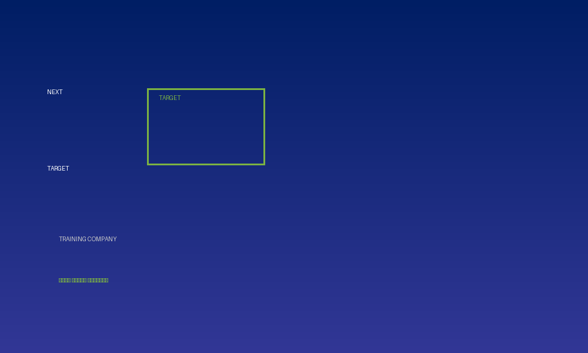

# الخطة التشغيلية | Operational Plan
## Next Target Training Company | نكست تارجت للتدريب والاستشارات



---

## 📋 نظرة عامة | Overview

This is the **Operational Plan for Q1 2026** for Next Target Training Company, a Saudi-based corporate training and consultancy firm based in Dammam. The plan focuses on optimizing operations while minimizing costs and maintaining high-quality service delivery.

هذه هي **الخطة التشغيلية للربع الأول 2026** لشركة نكست تارجت للتدريب والاستشارات، شركة متخصصة في التدريب والاستشارات الإدارية في المملكة العربية السعودية.

---

## 📁 Project Contents | محتويات المشروع

### 📄 Documents | المستندات

1. **NextTarget_Operational_Plan_Q1_2026.docx**
   - Professional Microsoft Word document
   - Native Word equations and professional formatting
   - Bilingual content (Arabic & English)
   - Ready for editing and printing
   - **ملف Word احترافي مع تنسيق عالي الجودة**

2. **NextTarget_Operational_Plan.html**
   - Responsive web-based HTML version
   - Professional styling with corporate branding
   - Logo prominently displayed
   - Mobile and print-friendly
   - **نسخة ويب متجاوبة مع شعار الشركة**

3. **NextTarget_Operational_Plan_Q1_2026.pdf**
   - Professional PDF export
   - Print-ready format
   - Bilingual layout
   - Optimized for viewing and sharing
   - **نسخة PDF جاهزة للطباعة**

4. **NextTarget_Logo.png**
   - Company branding logo
   - High-resolution image
   - Used across all documents
   - **شعار الشركة**

---

## 🎯 Key Highlights | النقاط الرئيسية

### Budget Allocation | توزيع الميزانية

| Item | Amount | Percentage |
|------|--------|-----------|
| **Staff Salaries** | 15,000 SAR | 15% |
| **Marketing & Content** | 18,000 SAR | 18% |
| **Office Rent** | 30,000 SAR | 30% |
| **Licenses & Insurance** | 15,000 SAR | 15% |
| **Utilities & Admin** | 12,000 SAR | 12% |
| **Technical Tools** | 10,000 SAR | 10% |
| **TOTAL Q1 2026** | **100,000 SAR** | **100%** |

### Organizational Structure | الهيكل التنظيمي

- **Operations Manager** - 3,500 SAR/month
- **Training Coordinator** - 1,500 SAR/month
- **Monthly Total**: 5,000 SAR (3 months = 15,000 SAR)

### Key Performance Indicators | المؤشرات الرئيسية للأداء

| KPI | Target | Frequency |
|-----|--------|-----------|
| New Clients Acquisition | 20+ | Monthly |
| Customer Satisfaction Rate | 85%+ | Monthly |
| Return on Investment (ROI) | 200%+ | Quarterly |
| Cost of Customer Acquisition | < 500 SAR | Monthly |
| Profit Margin | 30%+ | Monthly |

---

## 💼 Strategic Objectives | الأهداف الاستراتيجية

✅ **Deliver high-quality training programs**
✅ **Improve profitability through process optimization**
✅ **Build strong market reputation in Saudi Arabia**
✅ **Expand client base efficiently**
✅ **Maintain operational excellence**

---

## 🔧 Implementation Methods | آليات التنفيذ

### Marketing Strategy | استراتيجية التسويق

- 📱 **Social Media Marketing** - Organic reach, zero ad spend
- 📝 **Content Marketing** - Weekly posts with high reusability
- 🤝 **Strategic Partnerships** - Collaboration with other companies
- 📧 **Email Marketing** - Existing clients + new prospects

### Operations Management | إدارة العمليات

- 🎯 **CRM System** - Simple yet effective client management
- 🕐 **Automated Scheduling** - Minimize manual errors
- 📊 **Digital Tracking** - Daily performance reports
- 📅 **Monthly Reviews** - Performance evaluation and improvement

---

## 📊 Budget Optimization | تحسين الميزانية

### Cost-Saving Measures | إجراءات تقليل التكاليف

1. **Eliminated Training Coordinator Position** from original plan
2. **Optimized Marketing Budget** - Focused on organic and efficient channels
3. **In-house Content Production** - Maximum reusability
4. **Remote Training Delivery** - Minimal infrastructure costs
5. **Automated Systems** - Reduced administrative overhead

---

## 🌐 How to Use These Files | كيفية استخدام الملفات

### For Microsoft Word (DOCX)
```
1. Download: NextTarget_Operational_Plan_Q1_2026.docx
2. Open in Microsoft Word
3. Edit and customize as needed
4. Maintain professional formatting
5. Print or save as PDF
```

### For Web Viewing (HTML)
```
1. Open: NextTarget_Operational_Plan.html in any web browser
2. Share the link with stakeholders
3. Print directly from browser
4. Responsive design for mobile viewing
```

### For PDF Distribution
```
1. Download: NextTarget_Operational_Plan_Q1_2026.pdf
2. Share via email or cloud storage
3. Print-ready format
4. No editing required
```

---

## 📈 Success Factors | عوامل النجاح

### Key Success Areas | مناطق النجاح الرئيسية

| Factor | Strategy | Measurement |
|--------|----------|-------------|
| **Operational Efficiency** | Automated processes | Monthly review |
| **Service Quality** | High training standards | Client feedback (85%+) |
| **Cost Management** | Budget adherence | Monthly tracking |
| **Client Satisfaction** | Responsive support | NPS scoring |
| **Continuous Improvement** | Monthly evaluations | KPI achievement |

---

## 📞 Contact Information | معلومات التواصل

**Next Target Training Company**
- Company: نكست تارجت للتدريب والاستشارات
- Location: Dammam, Saudi Arabia
- Focus: Corporate Training & Consultancy

---

## 📅 Timeline | الجدول الزمني

- **Q1 2026**: Implementation of operational plan
- **Month 1-2**: Foundation and process optimization
- **Month 3**: Performance evaluation and Q2 planning

---

## 📋 Document Specifications | مواصفات المستندات

### Word Document (DOCX)
- **Pages**: 6 pages
- **Language**: Bilingual (Arabic & English)
- **Format**: Professional corporate document
- **Equations**: Native Word equations for financial data
- **Compatibility**: Microsoft Word 2013+

### HTML Document
- **Responsive Design**: Mobile and desktop optimized
- **Browser Compatibility**: All modern browsers
- **Features**: Bilingual, printable, interactive tables
- **Branding**: Next Target logo prominently displayed

### PDF Document
- **Pages**: 6 pages
- **Format**: Print-ready
- **Resolution**: High-quality output
- **Compatibility**: Universal PDF readers

---

## 🔐 Version Control

| Version | Date | Changes |
|---------|------|---------|
| 1.0 | August 2026 | Initial operational plan for Q1 2026 |

---

## 📝 Notes for Stakeholders | ملاحظات للمسؤولين

### للمالك | For the Owner:
✅ Total budget allocation: 100,000 SAR for Q1 2026
✅ Monthly operational cost: ~33,333 SAR
✅ Salary cost: Only 15% of budget
✅ Profit projection: 30%+ margin
✅ All financial targets are achievable

### للفريق الإداري | For Management:
✅ Clear operational structure
✅ Defined KPIs for measurement
✅ Monthly review schedule
✅ Cost control mechanisms
✅ Growth targets aligned with budget

---

## 🎓 Best Practices | أفضل الممارسات

1. **Regular Monitoring** - Weekly performance checks
2. **Client Focus** - Customer satisfaction at 85%+
3. **Cost Control** - Budget adherence monthly
4. **Team Communication** - Monthly team meetings
5. **Continuous Improvement** - Quarterly strategic review

---

## 📚 Additional Resources | موارد إضافية

- Marketing Strategy: Content-focused, zero ad spend
- Training Delivery: Primarily online for scalability
- Client Management: Simple CRM system
- Performance Tracking: Digital monitoring tools

---

## ⚖️ Legal Notice | الإشعار القانوني

**© 2026 Next Target Training Company**

All rights reserved. This operational plan is proprietary and confidential. 
Unauthorized distribution or reproduction is prohibited.

**جميع الحقوق محفوظة - 2026**

---

## 🔄 Updates & Modifications | التحديثات والتعديلات

To update this plan:
1. Edit the appropriate document (DOCX preferred)
2. Update the HTML file for web version
3. Export to PDF for distribution
4. Update this README with version details
5. Commit changes to GitHub with clear messages

---

## 📧 Questions or Support?

For questions regarding this operational plan:
- Review the relevant document sections
- Check the KPIs and success factors
- Refer to the implementation methods
- Contact Next Target Training Company

---

**Document Language**: Bilingual (العربية & English)
**Last Updated**: August 2026
**Status**: Active and Operational
**Classification**: Internal Use

---

### Viewer Instructions | تعليمات المشاهدة

**لعرض الملفات:**
- استخدم **Microsoft Word** لملف DOCX
- استخدم **متصفح الويب** لملف HTML
- استخدم **قارئ PDF** لملف PDF
- انسخ **شعار النقل** في المستندات الأخرى

**To view files:**
- Use **Microsoft Word** for DOCX files
- Use **Web Browser** for HTML files
- Use **PDF Reader** for PDF files
- Copy **logo image** for other documents

---

**Next Target Training Company | نكست تارجت للتدريب والاستشارات**
*Strategic Planning for Sustainable Growth*
*التخطيط الاستراتيجي للنمو المستدام*

🚀 Ready to Succeed | جاهزون للنجاح 🚀
